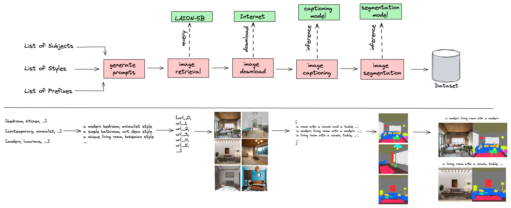

# ControlNet Interior Design Pipeline


<p align="center">
    <a href="https://github.com/ml6team/fondant">
        
    </a>
</p>
<p align="center">
</p>

## Introduction
This example demonstrates an end-to-end [fondant](https://github.com/ml6team/fondant) pipeline to collect and process data for the fine-tuning of a [ControlNet](https://github.com/lllyasviel/ControlNet) model, focusing on images related to interior design.

The resulting model allows you to generate the room of your dreams:


| Input image                                                                      | Output image                                                              |
|----------------------------------------------------------------------------------|---------------------------------------------------------------------------|
|            |  |
|            |  |

Want to try out the resulting model yourself, head over to our 
[Hugging Face space](https://huggingface.co/spaces/ml6team/controlnet-interior-design)!

Check out this doc for more information on ControlNet and how to use it: [docs/controlnet.md](docs/controlnet.md).

## Pipeline Overview

The image below shows the entire pipeline and its workflow. Note that this workflow is currently adapted to the interior design domain, but can be easily adapted to other domains by changing the prompt generation component.




There are 5 components in total, these are:

1. [**Prompt Generation**](components/generate_prompts): This component generates a set of seed prompts using a rule-based approach that combines various rooms and styles together, like “a photo of a {room_type} in the style of {style_type}”. As input, it takes in a list of room types (bedroom, kitchen, laundry room, ..), a list of room styles (contemporary, minimalist, art deco, ...) and a list of prefixes (comfortable, luxurious, simple). These lists can be easily adapted to other domains. The output of this component is a list of seed prompts.

2. [**Image URL Retrieval**](https://github.com/ml6team/fondant/tree/main/components/prompt_based_laion_retrieval): This component retrieves images from the [LAION-5B](https://laion.ai/blog/laion-5b/) dataset based on the seed prompts. The retrieval itself is done based on CLIP embeddings similarity between the prompt sentences and the captions in the LAION dataset. This component doesn’t return the actual images yet, only the URLs. The next component in the pipeline will then download these images.

3. [**Download Images**](https://github.com/ml6team/fondant/tree/main/components/download_images): This component downloads the actual images based on the URLs retrieved by the previous component. It takes in the URLs as input and returns the actual images, along with some metadata (like their height and width).

4. [**Add Captions**](https://github.com/ml6team/fondant/tree/main/components/caption_images): This component captions all images using [BLIP](https://huggingface.co/docs/transformers/model_doc/blip). This model takes in the image and generates a caption that describes the content of the image. This component takes in a Hugging Face model ID, so it can use any [Hugging Face Hub model](https://huggingface.co/models).

5. [**Add Segmentation Maps**](https://github.com/ml6team/fondant/tree/main/components/segment_images): This component segments the images using the [UPerNet](https://huggingface.co/docs/transformers/model_doc/upernet) model. Each segmentation map contains segments of 150 possible categories listed [here](https://huggingface.co/openmmlab/upernet-convnext-small/blob/main/config.json#L110).


## Getting started

> ⚠️ **Prerequisites:**
>
> - A Python version between 3.8 and 3.11 installed on your system.
> - Docker installed and configured on your system.
> - A GPU is recommended to run the model-based components of the pipeline.

### Cloning the repository

Clone this repository to your local machine using one of the following commands:

**HTTPS**
```shell
git clone https://github.com/ml6team/fondant-usecase-controlnet.git
```

**SSH**
```shell
git clone git@github.com:ml6team/fondant-usecase-controlnet.git
```

### Installing the requirements

```shell
pip install -r requirements.txt
```

Confirm that Fondant has been installed correctly on your system by executing the following command:

```shell
fondant --help
```

### Running the pipeline

There are two options to run the pipeline:

- [Via python files and the Fondant CLI](./src/README.md): how you should run Fondant in production
- [Via a Jupyter notebook](./src/pipeline.ipynb): ideal to learn about Fondant

## Train your own ControlNet model

Apparently, creating data for ControlNet fine-tuning is the most challenging part. However, Huggingface provides an easy way to fine-tune your own ControlNet model using the Diffusers library.
After publishing your dataset, you can initiate a fine-tuning job and specify the Huggingface dataset you wish to use as training data.

Resources: 
- [Blog post on how to fine tune your own ControlNet model](https://huggingface.co/blog/train-your-controlnet)
- [Diffusers library](https://github.com/huggingface/diffusers/tree/main) and [ControlNet training script](https://github.com/huggingface/diffusers/blob/main/examples/controlnet/train_controlnet.py)   
