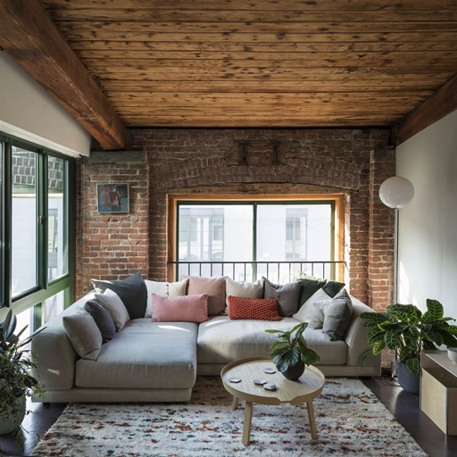
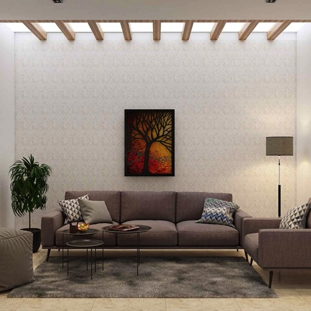

# ControlNet Interior Design Pipeline


<p align="center">
    
</p>
<p align="center">
</p>

## Introduction
This example demonstrates an end-to-end fondant pipeline to collect and process data for the fine-tuning of a [ControlNet](https://github.com/lllyasviel/ControlNet) model, focusing on images related to interior design.

The resulting model allows you to generate the room of your dreams:


| Input image                                                                      | Output image                                                     |
|----------------------------------------------------------------------------------|------------------------------------------------------------------|
|  |  |
|            |  |
|            |  |

Want to try out the resulting model yourself, head over to our 
[Hugging Face space](https://huggingface.co/spaces/ml6team/controlnet-interior-design)!

Check out this doc for more information on ControlNet and how to use it: [docs/controlnet.md](docs/controlnet.md).

## Pipeline Overview

The image below shows the entire pipeline and its workflow. Note that this workflow is currently adapted to the interior design domain, but can be easily adapted to other domains by changing the prompt generation component.


There are 5 components in total, these are:

1. [**Prompt Generation**](components/generate_prompts): This component generates a set of seed prompts using a rule-based approach that combines various rooms and styles together, like “a photo of a {room_type} in the style of {style_type}”. As input, it takes in a list of room types (bedroom, kitchen, laundry room, ..), a list of room styles (contemporary, minimalist, art deco, ...) and a list of prefixes (comfortable, luxurious, simple). These lists can be easily adapted to other domains. The output of this component is a list of seed prompts.

2. [**Image URL Retrieval**](https://github.com/ml6team/fondant/tree/main/components/prompt_based_laion_retrieval): This component retrieves images from the [LAION-5B](https://laion.ai/blog/laion-5b/) dataset based on the seed prompts. The retrieval itself is done based on CLIP embeddings similarity between the prompt sentences and the captions in the LAION dataset. This component doesn’t return the actual images yet, only the URLs. The next component in the pipeline will then download these images.

3. [**Download Images**](https://github.com/ml6team/fondant/tree/main/components/download_images): This component downloads the actual images based on the URLs retrieved by the previous component. It takes in the URLs as input and returns the actual images, along with some metadata (like their height and width).

4. [**Add Captions**](https://github.com/ml6team/fondant/tree/main/components/caption_images): This component captions all images using [BLIP](https://huggingface.co/docs/transformers/model_doc/blip). This model takes in the image and generates a caption that describes the content of the image. This component takes in a Hugging Face model ID, so it can use any [Hugging Face Hub model](https://huggingface.co/models).

5. [**Add Segmentation Maps**](https://github.com/ml6team/fondant/tree/main/components/segment_images): This component segments the images using the [UPerNet](https://huggingface.co/docs/transformers/model_doc/upernet) model. Each segmentation map contains segments of 150 possible categories listed [here](https://huggingface.co/openmmlab/upernet-convnext-small/blob/main/config.json#L110).


## Install and Run

### Usage

**Prerequisite:**

- Ensure Python version 3.8 to 3.10 is installed on your system.
- Install and configure Docker on your system.
- Ensure that you have a GPU for running the GPU-based component of the pipeline.


Follow these steps to get started and running the Fondant pipeline on your local machine.

1. **Setup your environment:** Clone this repository to your local machine using the following
   command:

```shell
git clone https://github.com/ml6team/fondant-usecase-controlnet.git
```

or use SSH instead:

```shell
git clone git@github.com:ml6team/fondant-usecase-controlnet.git
```

Afterwards, you can install all needed requirements:

```shell
pip install -r requirements.txt
```

You can confirm that Fondant has been installed correctly on your system by executing the following
command:

```shell
fondant --help
```

2**Run the pipeline:** Please navigate to the root directory of this repository and perform the
   following:

```shell
fondant run local pipeline.py
```

The pipeline will be compiled into a `docker-compose.yaml` file and subsequently executed.

Fondant provides various runners to execute the pipeline in different environments. If you intend to
run the pipeline in a production environment, you can utilize, for example,
the [Vertex AI runner](https://fondant.ai/en/latest/pipeline/#vertex-runner).

NOTE: The public clip service can only handle a few requets at a time, if you run into [timeout issues](https://github.com/rom1504/clip-retrieval/issues/267) t
hen you might want to host your own clip service following this [guide](https://github.com/rom1504/clip-retrieval/blob/main/docs/laion5B_h14_back.md)
## Reusing this pipeline

Adapt this pipeline for your own use case is simply a matter of editing the generate_prompts [component](./components/generate_prompts/src/main.py). You can leverage the existing structure, but generate prompts covering a different domain.
